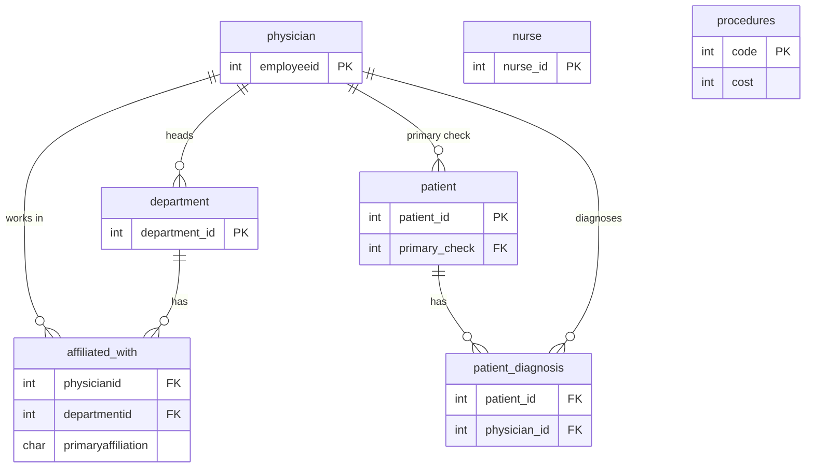

# Hospital Database: SQL Practice


This is a SQL practice project: one small hospital database and 33 queries
against it, from simple filters up to window functions and CTEs.
It's the kind of project you build while learning SQL. I've kept it as that and
tidied it so it actually runs, and so each answer is checked.

The data is made up: every name, address and phone number is invented. The table
design (physicians, departments, affiliations, nurses, patients, diagnoses,
procedures) is a common SQL-practice layout.

## What was wrong with the first version, and what I did about it

I went back over my own first version and found three problems:

1. **The script didn't run.** `affiliated_with` was created before `department`,
   but it has a foreign key pointing at `department`. MySQL refuses that. The
   tables are now created parents first (`sql/schema.sql`).
2. **Query 24 gave the wrong answer.** It was meant to list physicians with *no*
   primary department. It filtered on `primaryaffiliation = 'f'`, which also
   catches doctors who have a secondary department **and** a primary one. It
   returned 10 doctors; the right answer is 8 (Dr. Rivera and Dr. Patel were
   wrongly included). It now uses `NOT EXISTS` to look for doctors with no `'t'` row.
3. **`nurse` had no primary key**, so nothing stopped two nurses sharing an id.
   It has one now, and the tables have `CHECK` constraints too (a procedure can't
   cost 0, `primaryaffiliation` can only be `'t'` or `'f'`).

I also pulled the two queries that *change* data (the `UPDATE` and the
`DROP COLUMN`) into their own file, so running the other queries can't break
them by accident.

## How the tables connect



35 physicians, 15 departments, 37 affiliations, 33 nurses, 39 patients, 39
diagnoses, 20 procedures. `nurse` and `procedures` stand alone.

## The queries (`sql/queries.sql`)

| Queries | What they practise |
|---|---|
| 1-6, 10-13 | `SELECT`, `WHERE`, `ORDER BY`, `LIKE` patterns, `BETWEEN`, averages |
| 14-18 | `JOIN`s, including a `LEFT JOIN` and a three-table join |
| 9, 19-23 | Subqueries |
| 24 | `NOT EXISTS` (the corrected one) |
| 25, 27, 33 | Window functions: `RANK`, running `SUM`, `DENSE_RANK` |
| 26, 28, 32 | `GROUP BY` with `CASE` |
| 29 | `HAVING` |
| 30 | `NOT EXISTS` again, to find doctors with no patients |
| 31 | A CTE (two of them, chained) |

Q7 and Q8 (the `UPDATE` and `ALTER TABLE ... DROP COLUMN`) are in
`sql/maintenance_examples.sql`. Q12 originally asked for names starting with J and
ending in Z, which matches nobody in this data, so I changed the pattern to S.

## Running it

You only need Python 3 (nothing to install, it uses the built-in `sqlite3`):

```bash
python run_queries.py            # every query and its result
python run_queries.py 24 25      # just Q24 and Q25
python run_queries.py --save     # also writes output/results.md
python -m pytest tests -q        # 17 tests (needs: pip install pytest)
```

`output/results.md` has every result already, so you can read the answers without
running anything.

### The tests

They don't just check that each query runs. For most of them I work out the
expected answer in plain Python from the raw tables and compare. For example the
Q24 test proves the original query returned `{3, 7}` too many, the pattern
queries are checked against Python string methods, and the running total in
Q27 is checked against a running sum. There are also tests that the constraints
reject bad rows, and that the data itself is sound (one primary department per
doctor, every department head works in their own department, no patient
without a diagnosis).

### Using it on MySQL or PostgreSQL

The SQL is plain enough to run as it is on PostgreSQL. For MySQL, change `||`
string joins to `CONCAT(a, ' ', b)` and load `schema.sql` then `data.sql`.

## Layout

```
run_queries.py                  builds the database in memory, runs the queries
sql/schema.sql                  tables, keys and checks (parents first)
sql/data.sql                    the sample rows
sql/queries.sql                 Q1-Q33 (Q7 and Q8 are in the next file)
sql/maintenance_examples.sql    the two queries that change data
tests/test_hospital.py          17 tests
output/results.md               every query's result
```

Built with SQL and Python (`sqlite3`, `pytest`).

Muhammad Adnan, [LinkedIn](https://linkedin.com/in/muhammad-adnan-740336293),
adnandanish0404@gmail.com
